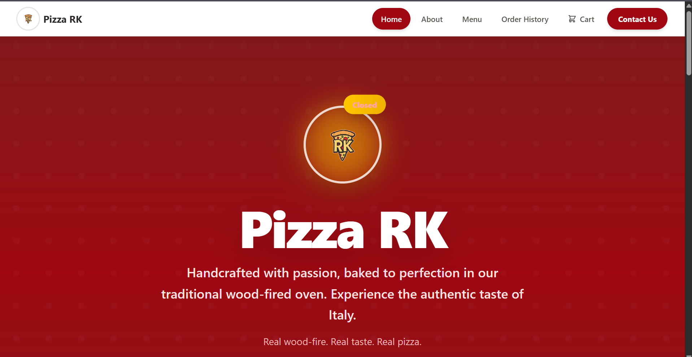
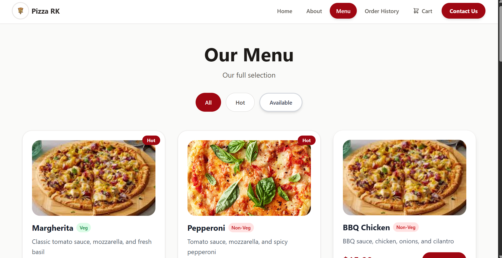

# 🍕 Pizza RK

**Handcrafted with passion, baked to perfection in our traditional wood-fired oven. Experience the authentic taste of Italy.**

_Real wood-fire. Real taste. Real pizza._

---

## 📸 Screenshots

### Home Page



### Menu Page



---

## 🚀 Features

- **Interactive Menu** — Browse pizzas with filters (All, Hot, Available) and detailed descriptions
- **Veg / Non-Veg Tags** — Clearly labeled dietary badges on every item
- **Shopping Cart** — Add pizzas, adjust quantities, and remove items with real-time updates
- **Order Tracking** — Live order status after placing an order
- **Order History** — Past orders saved in local storage (up to 50 orders)
- **Contact Form** — Reach out via integrated Formspree contact form
- **Toast Notifications** — Instant feedback on cart and order actions
- **Open / Closed Status** — Dynamic restaurant availability indicator
- **Responsive Design** — Fully responsive across desktop, tablet, and mobile

---

## 🛠️ Tech Stack

| Technology           | Purpose                   |
| -------------------- | ------------------------- |
| **React 19**         | UI library                |
| **Vite 7**           | Build tool & dev server   |
| **React Router DOM** | Client-side routing       |
| **React Toastify**   | Toast notifications       |
| **Formspree**        | Contact form backend      |
| **CSS**              | Custom styling            |
| **LocalStorage**     | Order history persistence |

---

## 📦 Getting Started

### Prerequisites

- [Node.js](https://nodejs.org/) (v18 or higher recommended)
- npm or yarn

### Installation

```bash
# Clone the repository
git clone https://github.com/your-username/pizza-menu.git

# Navigate to the project
cd pizza-menu

# Install dependencies
npm install
```

### Development

```bash
# Start the development server
npm run dev
```

The app will be available at `http://localhost:5173`.

### Build for Production

```bash
# Create an optimized production build
npm run build

# Preview the production build
npm run preview
```

---

## 📁 Project Structure

```
pizza-menu/
├── public/
│   └── pizzas/
├── src/
│   ├── assets/           # Pizza images & logo
│   ├── context/          # React context (if used)
│   ├── pages/
│   │   ├── About.jsx     # About page
│   │   ├── cart.jsx       # Shopping cart
│   │   ├── Contact.jsx    # Contact form
│   │   ├── Footer.jsx     # Footer component
│   │   ├── Home.jsx       # Landing page
│   │   ├── menu.jsx       # Menu with pizza listings
│   │   ├── navbar.jsx     # Navigation bar
│   │   ├── OrderHistory.jsx # Past orders
│   │   └── ordertrack.jsx # Live order tracking
│   ├── App.jsx            # Main app component
│   ├── App.css            # App styles
│   ├── index.css          # Global styles
│   └── main.jsx           # Entry point
├── index.html
├── package.json
├── vite.config.js
└── eslint.config.js
```

---

## 🍕 Menu Highlights

| Pizza          | Type       | Price  |
| -------------- | ---------- | ------ |
| Margherita     | 🟢 Veg     | $12.99 |
| Pepperoni      | 🔴 Non-Veg | $14.99 |
| BBQ Chicken    | 🔴 Non-Veg | $15.99 |
| Veggie Delight | 🟢 Veg     | $13.99 |
| Hawaiian       | 🔴 Non-Veg | $14.99 |

---

## 📜 License

This project is for personal / educational use.

---

<p align="center">Made with ❤️ by <strong>RK</strong></p>
